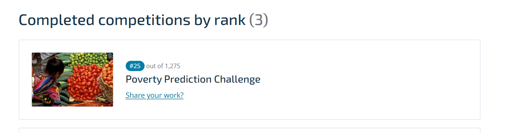
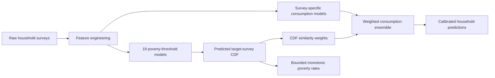

# Poverty Prediction Challenge — 25th place

[](https://github.com/M39L/poverty_prediction_challenge/actions/workflows/ci.yml)
[](https://www.python.org/)
[](LICENSE)

A survey-adaptive machine-learning pipeline developed for the World Bank and
DrivenData **Poverty Prediction Challenge**. The selected competition
submission finished **25th** on the final leaderboard.

This repository is a cleaned and reproducible implementation of the approach
developed during the competition. It predicts both household consumption and
population poverty-rate distributions under survey-to-survey domain shift.

- **Final rank:** 25th
- **Scale:** 1,322 registered participants and 500+ valid solutions
- **Portfolio result:** top 5% of valid solutions
- **Stack:** Python, pandas, NumPy, scikit-learn, LightGBM, pytest, GitHub Actions
- **Competition:** [Poverty Prediction Challenge](https://www.cisco.drivendata.org/competitions/305/competition-worldbank-poverty/)
- **Organizer recap:** [World Bank challenge overview](https://www.worldbank.org/en/topic/measuringpoverty/brief/poverty-prediction-challenge)

## Leaderboard result

The final ranking shown on my DrivenData profile:



## Problem

Many countries run comprehensive household-consumption surveys infrequently.
The challenge simulated the task of using older, labeled surveys to estimate
welfare indicators for newer surveys with no consumption labels.

The model had to produce two outputs for each test survey:

1. daily per-capita household consumption in 2017 USD PPP;
2. population poverty rates at 19 predefined consumption thresholds.

The central modeling difficulty is **domain shift**: train and test surveys
differ in geography, time, sampling design and consumption patterns.

### Competition metric

The primary error combines:

- **90%** weighted MAPE for the poverty-rate distribution;
- **10%** household-level MAPE for consumption.

Lower is better. Thresholds near the 40th percentile receive the highest
weight in the poverty component.

## Solution

The final approach combines economic feature engineering with explicit
survey-domain adaptation:

1. **Consumption diversity.** `consumed_yes_count` counts positive consumption
   indicators and acts as a compact proxy for household welfare.
2. **Survey-specific regressors.** A separate LightGBM model learns the
   consumption distribution of each labeled survey.
3. **Poverty-CDF models.** Nineteen weighted LightGBM models estimate the
   probability of falling below each official poverty threshold.
4. **CDF-based donor matching.** The predicted CDF of a target survey is
   compared with known training-survey CDFs to determine ensemble weights.
5. **Constrained output.** Predictions are clipped to valid ranges and poverty
   rates are made monotonically non-decreasing across thresholds.



## Leakage-safe validation

Random row splits would leak survey-specific patterns into validation. The
repository therefore includes **leave-one-survey-out validation**:

1. one complete survey is held out;
2. preprocessing is fitted only on the other surveys;
3. all consumption and poverty models are trained only on donor surveys;
4. the untouched survey is transformed and scored;
5. the process is repeated for all three surveys.

This is deliberately stricter than an ordinary train/validation split and
better represents the hidden test-survey setting.

Run the full validation with:

```bash
python validate.py --data-dir data --n-estimators 400
```

For a faster pipeline check:

```bash
python validate.py --data-dir data --n-estimators 50
```

### Model comparison

The table below was generated with 100 trees per model to keep the public
validation experiment practical. Scores are averaged across the three
held-out surveys; lower is better.

| Model | Consumption MAPE | Poverty weighted MAPE | Blended score |
|---|---:|---:|---:|
| Pooled LightGBM baseline | 0.2914 | 0.1289 | 14.5107 |
| **Survey-adaptive CDF ensemble** | **0.2919** | **0.0205** | **4.7651** |

The adaptive model reduces the mean blended validation error by **67.2%**,
almost entirely through better survey-level poverty-rate estimation. Its
household-consumption MAPE remains comparable to the pooled baseline.

Fold-level results are written to `reports/validation_results.csv`.

## Repository layout

```text
.
|-- main.py                     # End-to-end training and submission pipeline
|-- validate.py                 # Leave-one-survey-out model comparison
|-- src/
|   |-- preprocessing.py        # Encoding and economic features
|   |-- trainer.py              # Consumption and poverty models
|   |-- inference.py            # CDF matching and post-processing
|   |-- metrics.py              # Competition-aligned offline metrics
|   `-- utils.py
|-- tests/                      # Data-independent unit tests
|-- reports/                    # Fold-level validation results
|-- data/README.md              # Dataset download instructions
|-- requirements.txt
`-- requirements-dev.txt
```

Competition data and generated submissions are intentionally excluded from
Git. This keeps the repository small and respects the competition data terms.

## Reproduce the submission pipeline

Python 3.10 or 3.11 is recommended.

```bash
git clone https://github.com/M39L/poverty_prediction_challenge.git
cd poverty_prediction_challenge
python -m venv .venv
```

Activate the environment and install dependencies:

```bash
python -m pip install -r requirements.txt
```

Download the four competition files described in
[`data/README.md`](data/README.md), place them in `data/`, and run:

```bash
python main.py
```

Custom paths are supported:

```bash
python main.py --data-dir path/to/data --output-dir path/to/results
```

The command writes submission-ready files with the official schemas:

- `predicted_household_consumption.csv` — 103,023 household predictions;
- `predicted_poverty_distribution.csv` — 3 surveys × 19 thresholds.

## Tests and CI

The tests cover:

- numerical stability of the ensemble softmax;
- feature engineering;
- unseen categorical values;
- competition metric calculations;
- bounded and monotonic poverty post-processing.

```bash
python -m pip install -r requirements-dev.txt
python -m pytest -q
```

GitHub Actions runs the suite on every push and pull request.

## What worked

- modeling each source survey separately instead of assuming one shared
  consumption distribution;
- using consumption diversity as a domain-relevant welfare feature;
- weighting donor models by survey-level poverty-CDF similarity;
- enforcing domain constraints on the aggregate poverty output;
- validating on entire unseen surveys rather than random household rows.

## Limitations and next steps

- only three labeled surveys are available, so validation variance is high;
- the CDF ensemble uses hand-selected LightGBM hyperparameters;
- experiment metadata from the original exploratory notebooks was not tracked
  systematically;
- future work could add Optuna, MLflow, SHAP-based ablations and serialized
  model artifacts for batch inference.

## License and data

The source code is released under the [MIT License](LICENSE). Competition data
is not redistributed; download it directly from DrivenData under the
competition's terms.
